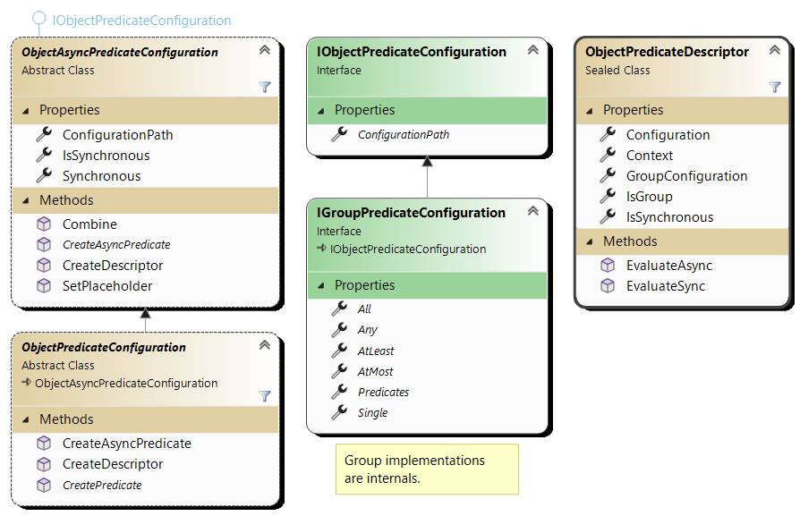

# CK.Object.Predicate

## Object predicates

This assembly provides [`ObjectAsyncPredicateConfiguration`](Async/ObjectAsyncPredicateConfiguration.cs)
that creates `Func<object,ValueTask<bool>>` configured predicates and the specialization 
[`ObjectPredicateConfiguration`](Sync/ObjectPredicateConfiguration.cs) 
that can also create `Func<object,bool>` predicates.

For simple scenario where predicates don't need external services, an empty service provider is used.

The predicate composite is [`IGroupPredicateConfiguration`](IGroupPredicateConfiguration.cs).
A group content is by default defined by a `Predicates` field (this can be changed when registering the type resolver).

A group defaults to 'All' (logical connector 'And') but can also be a "Any" or "Single" group (see below).

## Configuration sample.
A typical predicate configuration looks like this (in json):
```jsonc
{
  "Condition": {
    // No type resolved to "All" ("And" connector).
    "Predicate": [
      {
        "Predicates": [
          {
              // This is the same as below.
              "Type": true,
          },
          {
              // An intrinsic AlwaysTrue object predicate.
              // A "AlwaysFalse" is also available.
              "Type": "AlwaysTrue",
          },
          {
              // This (stupid) predicate is implemented in this assembly.
              "Assemblies": {"CK.Object.Predicate.Tests": "Tests"},
              "Type": "EnumerableMaxCount, Tests",
              "MaxCount": 5
          }
        ]},
        {
          // "Any" is the "Or" connector.
          "Type": "Any",
          "Assemblies": {"CK.Object.Predicate.Tests": "P"},
          "Predicates": [
            {
                "Type": "StringContains, P",
                "Content": "A"
            },
            {
                "Type": "StringContains, P",
                "Content": "B"
            }]
        },
        {
          // The "Group" with "AtLeast" enables a "n among m" condition.
          "Type": "Group",
          "AtLeast": 2,
          "Assemblies": {"CK.Object.Predicate.Tests": "P"},
          "Predicates": [
            {
                "Type": "StringContains, P",
                "Content": "x"
            },
            {
                "Type": "StringContains, P",
                "Content": "y"
            },
            {
                "Type": "StringContains, P",
                "Content": "z"
            }]
        }]
      }
   }
}
```

## Basic predicates.
`AlwaysTruePredicateConfiguration` and `AlwaysFalsePredicateConfiguration` are the simplest one.

The `NotPredicateConfiguration` holds an `Operand` predicate and reverts the operand evaluation
result (true &lt;--&gt; false).

The `IsTypePredicateConfiguration<T>` is helper: actual type match must be explicitely
defined: there is no "IsType" predicate with a "ExpectedType" expressed as an assembly qualified
name or other .Net naming. To use it (only the constructor needs to be relayed):
```csharp
public sealed class IsStringPredicateConfiguration : IsTypePredicateConfiguration<string>
{
    public IsStringPredicateConfiguration( IActivityMonitor monitor,
                                           TypedConfigurationBuilder builder,
                                           ImmutableConfigurationSection configuration )
        : base( monitor, builder, configuration )
    {
    }
}
```


## Predicate composite: the Group.

### "Any", "All", "Single" and "AtLeast"/"AtMost"
The [`IGroupPredicateConfiguration`]'(IGroupPredicateConfiguration.cs) is configured with two
integers "AtLeast" and "AtMost" (the base [`IGroupPredicateDecription`]'(IGroupPredicateDecription.cs)
interface describes this).

This enables a Group to handle logical operators between its predicates:
- "All" is the default and corresponds to the "And" operator ("AtLeast" = 0, "AtMost" = 0).
- "Any" corresponds to the "Or" operator ("AtLeast" = 1, "AtMost" = "0").
- "Single" corresponds to the "XOr" (exclusive or) operator ("AtLeast" = 1, "AtMost" = "1").
  Strictly speaking, this is a XOr when there are exactly 2 predicates in the Group but the
  semantics is extended to be "exactly one" to handle more than 2 predicates.

"AtLeast" and "AtMost" can be specified in the configuration but the easier way is to use
a property:
```jsonc
{
  "Type": "Group",
  "Any": true,
  "Predicates": [
  {
    "Type": "Group",
    "Single": true,
    "Predicates": [/* ... */]
  }
  ]
}
```
Or even simpler, the type name can be "All", "Any" or "Single":
```jsonc
{
  "Type": "Any",
  "Predicates": [
  {
    "Type": "Single",
    "Predicates": [/* ... */]
  },
  {
    "Type": "All",
    "Predicates": [/* ... */]
  }
  ]
}
```

### Logical pitfalls of 'All' and 'Any' and the "empty predicate".

When there is no subordinated predicates, what should a 'All' or 'Any' group answer? 
Linq `All`/`Any` extension methods answer are:
- An empty 'All' evaluates to true.
- An empty 'Any' evaluates to false.

This is a convention (that actually is the result of the code). One could have implemented this but instead
we rely on the fact that our `IGroupPredicateConfiguration` is not the predicate itself but a factory
of predicates: we allow `CreatePredicate` to return a null function. This null function is the "empty predicate".
A empty predicate result is not true nor false: it **is not**. This could also have been modeled by returning
a `bool?` instead of a `bool`  but ternary logic is tedious and error prone but this "empty predicate"
approach enable optimizations (and ease the support of placeholders).

An empty predicate is not an error, it's just that it has nothing to say and should simply be ignored
by callers. `IGroupPredicateConfiguration` filters out its null children predicates and eventually
returns a null predicate if it has no actual child predicate.

Note that `IGroupPredicateConfiguration` also avoids returning a stupidly complex predicate when
it has only one actual child predicate: it simply returns the single predicate since this works
for 'All' as well as 'Any' and 'Single' (note that for "AtLeast" or "AtMost" to be greater than 1
this requires at least 3 children).

## Sync vs. Async
Predicates can be asynchronous or synchronous. Calling an async function from a non async context
is forbidden by the Geneva conventions (well... at least it should be).

A parent synchronous predicate cannot contain a subordinated asynchronous predicate.
Moreover, an Async configuration may contain aspects specific to the asynchronous context
(typically a timeout).

> We explored the "2 families way" with 2 independent models. An adapter could then be used to
to create an Async predicate as a wrapper on its synchronous counterpart. It worked but was
tedious and composed badly with other families (like the Processors). With those two distinct
families, as soon as an async predicate was needed somewhere in the tree of configured objects,
all the predicates were doommed to be asynchronous... even the simple test of the length of a
string had to be asynchronous.

We finally came up with a much more efficient and powerful solution, at a price of some subtleties
in the implementation. 

All predicates expose the asynchronous API but their execution will be synchronous when possible.



The groups are optimized: if none of its subordinate children need to be asynchronous,
the group will be synchronous. This applies recursively up to the root: the root predicate will be
evaluated asynchronously if and only if there is one or more subordinate predicate that cannot be
evaluated synchronously.

Whenever possible synchronous predicate must be implemented by specializing `ObjectPredicateConfiguration`:
```csharp
public sealed class StringContainsPredicateConfiguration : ObjectPredicateConfiguration
{
    readonly string _content;

    public StringContainsPredicateConfiguration( IActivityMonitor monitor,
                                                 TypedConfigurationBuilder builder,
                                                 ImmutableConfigurationSection configuration )
        : base( configuration.Path )
    {
        var c = configuration["Content"];
        if( c == null )
        {
            monitor.Error( $"Missing '{configuration.Path}:Content' value." );
        }
        _content = c!;
    }

    public override Func<object, bool> CreatePredicate( IActivityMonitor monitor, IServiceProvider services )
    {
        return o => o is string s && s.Contains( _content );
    }
}
```
If a predicate can only be async (because evaluating it requires I/O), then it must specialize
the base `ObjectAsyncPredicateConfiguration` class.

A predicate can be defined twice, with a synchronous and an asynchronous implementation. The
two configurations MAY differ (slightly): the asynchronous version can for instance have a
"Timeout" configuration.

Such combinations are handled as kindly as possible. The [SyncAndAsyncPredicateTests](../Tests/CK.Object.Predicate.Tests/SyncAndAsyncPredicateTests.cs)
shows how sync and async predicates can coexist (by default) and how to force one over the other. 

### How it works.
The first thing to visualize is that the synchronous `ObjectPredicateConfiguration` specializes
the `ObjectAsyncPredicateConfiguration`: any synchronous predicate is by design an asynchronous one
that uses `ValueTask.FromResult()` to create the async `Func<object,ValueTask<bool>>`.

Then, when calling `ObjectAsyncPredicateConfiguration.AddResolver`, two resolvers are actualy added:
- First, the "Sync" family with `ObjectPredicateConfiguration` as the base type is added.
  When explictly resolving a sync predicate, only subordinated sync predicates are allowed.
  This prevents any sync-on-async to happen.
- Then, the more general resolver for base type `ObjectAyncPredicateConfiguration` is added
  and this resolver is configured to fall back on the sync resolver previously added if it cannot
  resolve a type.

The inheritance and the dual registrations with the fallback are the keys.

There is a little bit more complexity involved for Groups: when an async group is instantiated,
a factory method is used (instead of the constructor): this factory method returns a sync group
if all the predicates are sync. An async group is created only if it's necessary.

## Hooks for observability.

Created predicates are pure functions. When they are called, only the final result is observable, the decisions
taken are the result of the configuration without any explanations. Instead of pure functions, a predicate
object can be created from a configuration: their `Evaluate( object )` and `EvaluateAsync( object )` enables the
decisions to be analyzed.

The [`PredicateHookContext`](Hooks/PredicateHookContext.cs) enables to create wrapper rather than pure predicate
functions:
```csharp
public abstract class ObjectPredicateConfiguration : IObjectPredicateConfiguration
{
  /* ... */

  /// <summary>
  /// Creates a <see cref="ObjectPredicateHook"/> with this configuration and a predicate obtained by
  /// calling <see cref="CreatePredicate(IActivityMonitor, IServiceProvider)"/>.
  /// <para>
  /// This should be overridden if this predicate relies on other predicates in order to hook all of them.
  /// Failing to do so will hide some predicates to the evaluation hook.
  /// </para>
  /// </summary>
  /// <param name="monitor">The monitor that must be used to signal errors.</param>
  /// <param name="context">The hook context.</param>
  /// <param name="services">The services.</param>
  /// <returns>A wrapper bound to the hook context or null for an empty predicate.</returns>
  public virtual ObjectPredicateHook? CreateHook( IActivityMonitor monitor, PredicateHookContext context, IServiceProvider services )
  {
      var p = CreatePredicate( monitor, services );
      return p != null ? new ObjectPredicateHook( context, this, p ) : null;
  }
}
```
[`ObjectPredicateHook`](Hooks/Sync/ObjectPredicateHook.cs) (and [`ObjectAsyncPredicateHook`](Hooks/Async/ObjectAsyncPredicateHook.cs))
give access to the predicate's configuration and when they are [`GroupPredicateHook`](Hooks/Sync/ObjectPredicateHook.cs)
(and [`GroupAsyncPredicateHook`](Hooks/Async/GroupAsyncPredicateHook.cs)) they expose their subordinated
items: the whole resolved structure can be explored.

Note that hook follow the same "empty predicate" null management: a null hook is empty and should
be ignored.

The specialized [`MonitoredPredicateHookContext`](Hooks/MonitoredPredicateHookContext.cs) logs all the evaluator
along with their result and captures exceptions that evaluation may throw.

Sample usage (the evaluation of "Bzy" is logged into the `TestHelper.Monitor`):
```csharp
[Test]
public void complex_configuration_tree_with_EvaluationHook()
{
    MutableConfigurationSection config = GetComplexConfiguration();
    var builder = new TypedConfigurationBuilder();
    ObjectPredicateConfiguration.AddResolver( builder );

    var fC = builder.Create<ObjectPredicateConfiguration>( TestHelper.Monitor, config );
    Throw.DebugAssert( fC != null );

    var context = new MonitoredPredicateHookContext( TestHelper.Monitor );

    var f = fC.CreateHook( TestHelper.Monitor, context );
    f.Evaluate( "Bzy" ).Should().Be( true );
}
```

Because these hooks have the primary purpose to "explain" the configured process:
- The `PredicateHookContext` has an optional `UserMessageCollector` that can be used to emit
  translatable error, warnings and informations.
- the `MonitoredPredicateHookContext` (that adds a monitor) should be enough in practice.

> It is planned to add a `void Describe( UserMessageCollector description )` to the `ObjectPredicateHook`
  that will capture a translatable explanation of what it does in a human readable text (that includes
  its configured values).

## Placeholder support.

Configuration extensibility is supported thanks to the Placeholder pattern described here:
[../CK.Configuration/Tests/ConfigurationPlugins/StrategyPlugin/ExtensibleConfiguration](../Tests/ConfigurationPlugins/StrategyPlugin/ExtensibleConfiguration/README.md).
